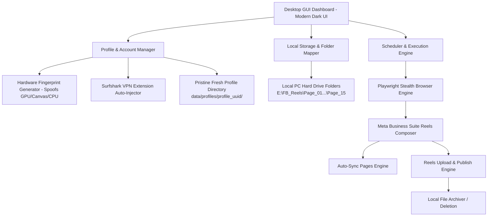

# 🚀 ANTI-DETECT FACEBOOK REELS AUTOMATION DESKTOP APP
## Master Technical Specification & Architecture Blueprint
**Version:** 2.1-PRO (Surfshark Extension & Fresh Sandbox Edition)  
**Target Platform:** Windows 10 / 11 Desktop Application  
**Author / Engineering Context:** Antigravity AI & Master Spec for Autonomous High-Reach Facebook Reels Automation

---

## 📌 Executive Summary & Background (Why This Project Exists)

### 1. The Core Problem with Facebook Graph API
Previous attempts to automate Facebook Pages using the official **Meta Graph API** (`/video_reels` or `/videos`) resulted in widespread **0-views suppression**. The reasons are structural:
* **Unpublished / Development Mode Traps:** Meta restricts Graph API uploads from apps in "Development" mode to admin-only views; they never enter public cold-audience discovery feeds.
* **Commercial API Reach Suppression:** Meta treats Graph API calls as enterprise/commercial automated bots. They prioritize paid Meta Ads over organic free distribution.
* **No Trending Music Attribution:** Graph API strictly disallows attaching copyrighted or trending consumer music tracks (only raw/original audio is permitted). In modern social media algorithms, **70–80% of initial discovery is driven by audio page aggregation**.
* **Cloud Datacenter IP Blacklisting:** Uploading via GitHub Actions or cloud server IPs (Microsoft Azure, AWS) triggers anti-bot scrutiny.

### 2. The Solution: Method B (Anti-Detect Browser Automation)
Instead of relying on the Graph API, this project builds a **Standalone Desktop Application** that controls **real browser sessions** (via Playwright / Chromium) running directly on the user's laptop.
* **Zero Google Drive Hassle:** Videos are stored locally on the PC hard drive (e.g., `E:\FB_Reels\...`). No 15GB Drive storage caps, no downloading lag, and zero Google API credentials.
* **100% Fresh & Isolated Chrome Sandboxes:** The app **NEVER touches or links to the user's host/personal Chrome profile** (`%LOCALAPPDATA%\Google\Chrome\User Data`). Every profile is created inside a brand-new, clean, dedicated sandbox directory.
* **Pre-Loaded Surfshark VPN Extension:** Every newly created profile automatically comes with the **Surfshark VPN Chrome Extension pre-installed and loaded out of the box**.
* **Device Fingerprint Spoofing (Anti-Detect):** When running 10–15 different Facebook accounts from one laptop, Facebook normally detects that the physical GPU, Canvas rendering, AudioContext, and screen resolution are identical, triggering linked bans. Our app **spoofs every single hardware signal** so that Facebook sees 10 completely different computers in different US cities.
* **Native Organic Reach:** Because videos are published through the real **Meta Business Suite / Reels Composer** interface inside a genuine browser with a US Surfshark VPN connection, Facebook treats the upload as a real human sitting at their PC, granting **100% full organic viral recommendation reach**.

---

## 🏛️ High-Level System Architecture



---

## 🧩 Core Architectural Modules (Micro-Level Breakdown)

### Module 1: Fresh Sandbox Profile & Anti-Detect Fingerprint Engine
This module guarantees that Facebook never links multiple Facebook accounts running on the same PC, and **strictly isolates automation from personal browsing**.

#### 1. Strict Fresh Sandbox Isolation (CRITICAL RULE)
* **Zero Host Chrome Contamination:** The application must **NEVER** read, access, or link to the user's host personal Chrome profile (`C:\Users\Win\AppData\Local\Google\Chrome\User Data`).
* Each profile is initialized in its own pristine, isolated directory on disk:
  `data/profiles/profile_<uuid>/`
* Contains brand-new, isolated Chrome user data: cookies, cache, LocalStorage, IndexedDB, and extensions.
* Profile 1 can never access, leak, or share data with Profile 2 or the host PC's personal Chrome.

#### 2. Hardware Fingerprint Parameters (Spoofed per Profile)
When a new profile is created, the system auto-generates a realistic, statistically valid hardware profile and **permanently locks (freezes)** it:
* **Operating System & User-Agent:** Windows 11 (Chrome 128+), Windows 10, or macOS Sonoma.
* **Canvas Fingerprint:** Unique mathematical 2D noise injected into canvas image operations.
* **WebGL Vendor & Renderer:** Spoofed graphics cards (e.g., `ANGLE (NVIDIA, NVIDIA GeForce RTX 3060 Direct3D11 vs_5_0 ps_5_0)`, `Apple M2`, `Intel(R) Iris(R) Xe Graphics`).
* **Hardware Specs:**
  * CPU Cores (`navigator.hardwareConcurrency`): 4, 8, 12, or 16.
  * Device Memory (`navigator.deviceMemory`): 8 GB, 16 GB, or 32 GB.
* **Screen Resolution:** Randomly selected from standard displays: `1920x1080`, `2560x1440`, `1440x900`, `1536x864`.
* **AudioContext Fingerprint:** Frequency variance injected into the Web Audio API synthesizer.
* **Timezone & Locale:** Automatically locked to US timezones (e.g., `America/New_York` or `America/Chicago` with `en-US` language) to prevent Indian Standard Time (IST) leakage.
* **WebRTC Leak Protection:** Public and private IP leaks via WebRTC are disabled or proxied.

---

### Module 2: Pre-Loaded Surfshark VPN Extension Engine

#### 1. Unpacked Extension Packaging
* The app bundles the official **Surfshark VPN Chrome Extension** files inside:
  `assets/extensions/surfshark/` (containing `manifest.json`, background scripts, and popup UI).
* Whenever a profile is launched (Setup Mode or Automation Mode), Playwright starts Chromium with:
  ```python
  surfshark_dir = os.path.abspath("assets/extensions/surfshark")
  context = playwright.chromium.launch_persistent_context(
      user_data_dir=profile_dir,
      headless=False, # Extensions require headed mode
      args=[
          f"--disable-extensions-except={surfshark_dir}",
          f"--load-extension={surfshark_dir}"
      ]
  )
  ```
* **Result:** As soon as the browser opens, the **Surfshark VPN icon is already sitting in the top toolbar**.

#### 2. One-Time VPN Sign-In:
* During initial setup of the profile, the user clicks the Surfshark extension icon, logs into their Surfshark account, and connects to a US location (e.g., New York, Miami, Los Angeles).
* Because the profile directory is persistent (`data/profiles/profile_<uuid>/`), **Surfshark stays logged in and auto-connects to the US location on every future launch!**

---

### Module 3: 1-Click Human Login Engine (Setup Mode)
* The user never hardcodes or enters Facebook passwords into the code.
* The App provides an **`[Open Browser to Login]`** button for each profile.
* When clicked:
  1. Opens a visible Chrome browser window with that profile's unique fresh sandbox, spoofed fingerprint, and **Surfshark VPN extension pre-loaded**.
  2. The user connects Surfshark to a US server.
  3. The user navigates to `https://www.facebook.com` or `https://business.facebook.com`.
  4. The user logs into their Facebook account, completes 2FA/CAPTCHA, and clicks "Remember Me".
  5. The user closes the browser.
* **Result:** All authentication cookies (`c_user`, `xs`, `fr`, etc.) are permanently saved in that isolated profile directory. Future automated runs execute 100% hands-free without ever prompting for credentials.

---

### Module 4: Page Auto-Sync Engine (Automatic Discovery)
* The user should never have to manually look up or copy-paste 15-digit Facebook Page IDs.
* Next to each logged-in profile, there is a **`[🔄 Sync Pages From This Account]`** button.
* **Execution Logic:**
  1. The engine silently loads the persistent context for that profile (with Surfshark active).
  2. Navigates to Meta Business Suite: `https://business.facebook.com/latest/home` or fetches the internal account list via GraphQL/cookie session.
  3. Discovers all Pages where the user has publishing/admin rights.
  4. Extracts for each Page:
     * `page_name` (e.g., "Charmy Owen")
     * `page_fb_id` (e.g., "1040244259164767")
     * `profile_picture_url`
     * `role`
  5. Saves this structured list to the local SQLite database.
  6. The GUI immediately renders a clean table displaying all synced pages with badges.

---

### Module 5: Local PC Folder Video Mapper
* For every synced Page, the UI displays a file path field and a **`[📁 Browse Folder]`** button.
* **Folder Structure Example on User's PC:**
  ```text
  E:\FB_Reels\
     ├── 01_Charmy_Owen\
     ├── 02_Horizon_Nest\
     ├── 03_Fresh_Hive\
     └── ...
  ```
* **Video Queue Logic:**
  * When executing a post, the engine scans the Page's local folder for `.mp4` or `.mov` files.
  * Picks the oldest unposted video.
  * Generates Caption:
    * Extracts title from filename (removing `.mp4` and file numbers like `(176)`).
    * Appends Page default hashtags (configured in settings).
    * Or reads an optional sidecar `.txt` file with the same base name if present.
* **Post-Upload Action (Configurable per Page):**
  * `Option 1 (Move):` Moves the posted video to `E:\FB_Reels\<Page_Name>\_posted\` to prevent duplicate uploads.
  * `Option 2 (Delete):` Permanently deletes the file from disk to save storage.

---

### Module 6: Meta Business Suite Reels Composer Automator (The Posting Core)
To ensure the automation **never breaks when Facebook changes its web layout**, the bot uses **direct composer endpoints and semantic HTML5 selectors**:

#### Step-by-Step Posting Lifecycle:
1. **Direct Navigation:**
   * Navigates directly to Meta Business Suite Reels Composer for that exact Page:
     `https://business.facebook.com/latest/reels_composer?page_id={PAGE_ID}`
   * Bypasses the complex homepage navigation and sidebar clicks.
2. **File Injection (Robust HTML5 Input):**
   * Locates the hidden file input element: `input[type="file"][accept*="video"]`.
   * Directly sets the file path using Playwright's `file_input.set_input_files(video_local_path)`.
   * Zero mouse drag-and-drop errors. Takes < 100 milliseconds.
3. **Caption Entry:**
   * Locates the content-editable caption container: `div[role="textbox"][contenteditable="true"]`.
   * Simulates realistic human typing using `page.keyboard.type(caption, delay=20)` to ensure all event listeners (React/GraphQL) trigger correctly.
4. **Processing & Next Phases:**
   * Monitors the video upload progress bar until it reaches 100% and displays the green processing checkmark.
   * Clicks through the "Next" buttons (`button:has-text("Next")`).
5. **Publish Action:**
   * Clicks the final **"Share / Publish"** (`button:has-text("Publish")` or `button:has-text("Share")`).
   * Waits for the success confirmation popup or redirect to `https://business.facebook.com/latest/posts/reels`.
6. **Error Handling & Failure Recovery:**
   * If a step times out or fails:
     * Takes an immediate timestamped screenshot saved to `logs/screenshots/error_<page_id>_<timestamp>.png`.
     * Saves the page HTML source code to `logs/html/error_<page_id>_<timestamp>.html`.
     * Logs the error to SQLite and continues safely to the next Page without crashing the application.

---

### Module 7: Desktop UI & Execution Scheduler
* **User Interface (Modern Dark Theme):**
  * Built using a modern lightweight desktop framework: **CustomTkinter** or **PyQt6** (or local Webview with HTML/Tailwind/CSS).
  * Tabs:
    1. **Dashboard:** Overview of active accounts, total posted today, upcoming schedules, and recent log stream.
    2. **Profiles & Accounts:** Add profiles, view spoofed fingerprints, one-click login, and sync pages.
    3. **Page Mappings:** Table of all Pages with folder paths and daily limits.
    4. **Manual Trigger ("Post Now"):** Run 1 Page or All Pages immediately with live progress bar.
    5. **Settings & Scheduler:** Configure 4 daily upload time slots and delays between posts.
* **Scheduler Engine:**
  * Runs in a background thread using Python's `APScheduler` library.
  * Can also register as a Windows Task Scheduler task so it wakes up automatically when the user is logged into Windows.
  * Introduces random human jitter: e.g., instead of posting at exactly 10:00:00 AM, it posts at 10:03:24 AM (3–7 minutes random delay between pages) so Facebook's behavioral detection sees 100% natural human patterns.

---

## 🗄️ Project File & Directory Structure

```text
fb_antidetect_automator/
├── assets/                       # Icons, logos, and UI graphics
│   └── extensions/
│       └── surfshark/            # Official unpacked Surfshark VPN extension
├── config/
│   └── settings.yaml             # Global application configuration
├── data/
│   ├── database.db               # SQLite database for profiles, pages & upload history
│   └── profiles/                 # 100% FRESH isolated user data directories (Zero host link)
│       ├── profile_01/           # Cookies, cache, Surfshark state for Account 1
│       └── profile_02/           # Cookies, cache, Surfshark state for Account 2
├── logs/
│   ├── app.log                   # Rolling application log
│   └── screenshots/              # Error screenshots for instant debugging
├── src/
│   ├── __init__.py
│   ├── core/
│   │   ├── fingerprint.py        # Hardware spoofing engine (Canvas, WebGL, Audio, CPU)
│   │   ├── browser_manager.py    # Playwright browser launcher with Surfshark injection
│   │   ├── page_sync.py          # Meta Business Suite automatic page scraper
│   │   └── uploader.py           # Reels composer automation & publish lifecycle
│   ├── db/
│   │   └── database.py           # SQLite manager & models
│   ├── scheduler/
│   │   └── task_runner.py        # Background scheduled job orchestrator
│   └── ui/
│       ├── app.py                # Main Desktop Window GUI
│       ├── components/           # Reusable UI widgets (cards, tables, modals)
│       └── styles.py             # Dark mode theme constants & styling
├── main.py                       # Application entry point
├── requirements.txt              # Python package dependencies
├── install.bat                   # 1-Click environment setup script for Windows
└── start.bat                     # 1-Click launcher shortcut for Desktop
```

---

## 📦 Requirements & Dependencies (`requirements.txt`)

```text
playwright>=1.47.0
playwright-stealth>=1.0.6
browserforge>=1.1.0
customtkinter>=5.2.2
Pillow>=10.4.0
apscheduler>=3.10.4
pyyaml>=6.0.2
requests>=2.32.3
```

---

## 🚀 Step-by-Step Implementation Roadmap for the Developer / AI Agent

When implementing this project from scratch in a fresh workspace, execute in this exact sequence:

### Phase 1: Environment & Core Engine Setup
1. Create virtual environment: `python -m venv venv`, activate: `venv\Scripts\activate`.
2. Install dependencies: `pip install -r requirements.txt`.
3. Install Chromium browser binaries: `playwright install chromium`.
4. Initialize SQLite schema in `src/db/database.py` with tables:
   * `profiles` (id, name, created_at, fingerprint_json, surfshark_connected)
   * `pages` (id, profile_id, page_name, page_fb_id, local_folder_path, enabled, daily_limit)
   * `upload_history` (id, page_id, video_filename, file_size, posted_at, status, error_msg)

### Phase 2: Hardware Fingerprint & Surfshark Browser Engine
1. Download official unpacked Surfshark extension into `assets/extensions/surfshark/`.
2. Implement `src/core/fingerprint.py`:
   * Use `browserforge` to generate randomized, realistic WebGL strings, screen resolutions, and platform headers.
   * Bind unique persistent context paths for each profile (`data/profiles/profile_<uuid>/`).
3. Implement `src/core/browser_manager.py`:
   * Method `open_setup_browser(profile_id)`: Opens visible browser with Surfshark extension pre-loaded for one-time manual Facebook & VPN login.
   * Method `get_stealth_context(profile_id)`: Returns automated session with spoofed Canvas/WebGL and Surfshark connected.

### Phase 3: Page Auto-Sync & Folder Queue Engine
1. Implement `src/core/page_sync.py`:
   * Navigates to `https://business.facebook.com/latest/home`.
   * Automatically parses the Page selection dropdown or Meta GraphQL accounts response.
   * Saves all discovered Pages into the `pages` database table.
2. Implement folder scanning:
   * Scans the assigned `local_folder_path`.
   * Filters out files already listed in `upload_history` or located in `_posted/`.

### Phase 4: Meta Business Suite Reels Uploader
1. Implement `src/core/uploader.py`:
   * Navigates directly to `https://business.facebook.com/latest/reels_composer?page_id={page_fb_id}`.
   * Injects file path into `input[type="file"]`.
   * Fills caption into content-editable div with human-like keystroke delays.
   * Waits for upload completion, clicks Next, then clicks Publish.
   * Confirms publish state, records to DB, and moves video to `_posted/`.

### Phase 5: Desktop GUI & Scheduling Integration
1. Build modern dark-theme GUI in `src/ui/app.py` using **CustomTkinter**:
   * Card for each Profile with buttons: `[Login / Edit]`, `[Sync Pages]`.
   * Table for Pages with `[Browse Folder]` picker.
   * Action button: `[▶ Run All Now]`.
2. Hook `APScheduler` in `src/scheduler/task_runner.py` for automated daily slot runs.
3. Package launcher into `start.bat` on the Desktop.

---

## 🛡️ Edge Cases, Anti-Ban Rules & Security Safeguards

1. **Strict Fresh Sandbox Rule:** NEVER touch `%LOCALAPPDATA%\Google\Chrome\User Data`. Every profile must use its own fresh folder under `data/profiles/`.
2. **Pre-Loaded Surfshark Rule:** Every profile launch must load the unpacked Surfshark extension automatically.
3. **Human Keystroke Timing:** Never use `element.fill(caption)`. Always use `page.keyboard.type(text, delay=25)` to simulate real human keyboard strokes.
4. **Page-to-Page Jitter:** Introduce a 2–5 minute random rest interval between uploading to consecutive Pages so Facebook does not detect burst uploads.
5. **Daily Limit Cap:** Enforce a hard daily cap (default 4 Reels per day per Page) to keep accounts in Meta's optimal recommendation tier.
6. **Isolated Memory & Storage:** Never launch two profiles in the same browser context. Always terminate context 1 completely before launching context 2.
7. **No Local Indian IP Leak:** Ensure Surfshark VPN is connected before Facebook pages load, so the user's real Indian ISP IP is never exposed.

---
*End of Master Specification. Ready for clean, autonomous implementation.*
